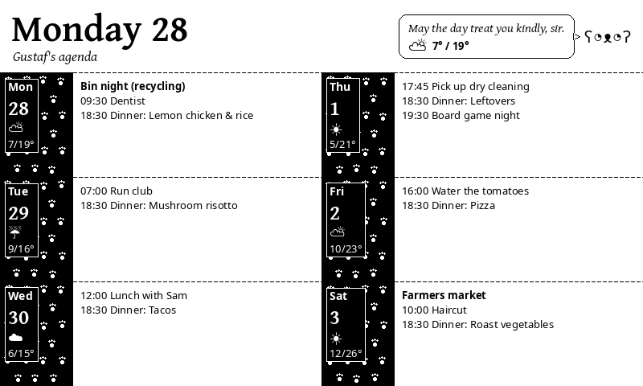

# eink-cal



Pulls a few iCal feeds, merges them, and renders the next six days as a single
800×480 greyscale PNG for an e-ink display. The PNG is uploaded to a public
static host (Cloudflare R2), so the display only ever fetches an image and
never talks to the calendar server.

The agenda belongs to Gustaf, my teddy bear butler, who greets you from the
top-right corner with a line picked for the time of day, the weekday and the
weather.

It's a personal tool, so expect to edit the config block rather than find a
flag for everything. Yes, I vibe coded it.

## What it does

- Fetches each calendar source over HTTPS (with optional basic auth), expands
  recurring events, and merges them.
- Fetches a daily forecast from [Open-Meteo](https://open-meteo.com/) (no API
  key) and caches the last good one, so a flaky network doesn't blank out the
  weather.
- Renders the image with Pillow and uploads it to R2 with
  `Cache-Control: no-cache`.
- If *every* calendar source fails, it exits non-zero without uploading, so
  the display keeps the last good image.

## Setup

```sh
python3 -m venv .venv
. .venv/bin/activate
pip install -r requirements.txt   # or requirements.lock for the pinned versions
```

It uses Noto fonts from `/usr/share/fonts/truetype/noto/` (Debian/Ubuntu:
`apt install fonts-noto-core fonts-noto-mono`) and the Gentium Plus fonts
bundled in `fonts/`.

### Config

Edit the config block at the top of `calendar_render.py`:

- `TZ`: your local timezone
- `DAYS`: how many days to show (default 6; 1–2 are one column, 3–6 two,
  7+ one column per day)
- `WIDTH`, `HEIGHT`: your display's resolution
- `OUTPUT`: local path for the rendered PNG
- `NC_CALENDARS`, `SOURCES`: the iCal feeds. The example reads Nextcloud
  calendars through their `?export` URLs as a dedicated read-only user that
  the calendars are shared with. Any public `.ics` URL works too, with
  `auth=None`.

Secrets and per-deployment settings come from the environment:

| Variable | Default | |
|---|---|---|
| `NC_USER` | `eink-cal` | Nextcloud user for basic auth |
| `NC_PASS` | (none) | Its password. Use an app password so it can be revoked on its own |
| `WEATHER_LAT`, `WEATHER_LON` | Canberra | Forecast location |
| `WEATHER_CACHE` | `weather_cache.json` next to the script | Set it empty to disable the cache |
| `R2_BUCKET` | (none) | Leave unset to only write `OUTPUT` locally |
| `R2_KEY` | `calendar.png` | Object key |
| `R2_ACCOUNT_ID`, `R2_ACCESS_KEY_ID`, `R2_SECRET_ACCESS_KEY` | (none) | R2 credentials |

## Run

```sh
NC_PASS='...' python3 calendar_render.py
```

## Cloudflare R2

1. In the Cloudflare dashboard, create an R2 bucket (e.g. `eink-cal`).
2. In the bucket's settings, enable the public `r2.dev` URL or attach a custom
   domain. This is the URL the display fetches.
3. Under R2 → Manage API Tokens, create a token with Object Read & Write
   scoped to the bucket, and note the Access Key ID and Secret Access Key.
4. Note your Account ID (shown in the R2 overview).

The display URL is then `https://pub-<id>.r2.dev/<R2_KEY>` (or your custom
domain). Anyone with the URL can see your week, so treat it as a secret and
use a hard-to-guess key, e.g. `R2_KEY=<random-uuid>/calendar.png`.

## Scheduling

### cron

Put the variables in `.env` and source it with `set -a`, so they're exported
to Python (a plain `. .env` only sets shell variables):

```
SHELL=/bin/bash
*/30 * * * * set -a; . /path/to/eink-cal/.env; set +a; /path/to/eink-cal/.venv/bin/python /path/to/eink-cal/calendar_render.py >> /path/to/eink-cal/cron.log 2>&1
```

### Container

The `Dockerfile` builds a small image with the fonts and pinned dependencies,
running as a non-root user. I run it as a Kubernetes CronJob. There, set
`WEATHER_CACHE=""` unless you mount somewhere writable for it.

```sh
docker build -t eink-cal .
docker run --rm --env-file .env -e WEATHER_CACHE= eink-cal
```

## Notes

- Multi-day events only render on their start day.
- Event titles are truncated rather than wrapped, and a day with more events
  than fit ends in `…`.

## Licenses

The code is under the [MIT License](LICENSE). The Gentium Plus fonts in
`fonts/` are © SIL International, under the
[SIL Open Font License 1.1](fonts/OFL.txt).
